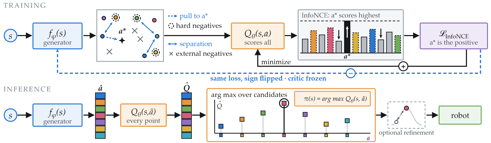
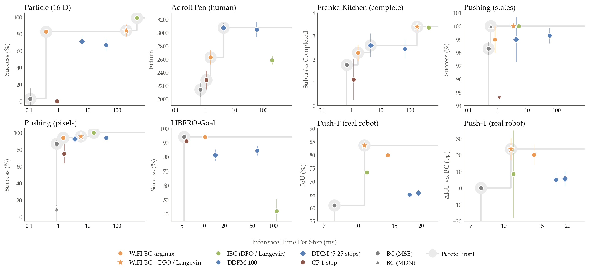

# WiFI-BC: Wire-Fitting Implicit Behavioral Cloning



## Abstract

Imitation learning algorithms face the dilemma of choosing between task success and inference-time
efficiency. Explicit methods provide the fastest inference but often fail to model complex,
discontinuous, or multimodal action distributions. On the other hand, implicit and diffusion-based
methods improve their success by iteratively refining their actions, which sacrifices efficiency.
Whereas some methods aim to distill diffusion policies while increasing inference speed, they
either suffer from significant performance decreases or their speed increase is limited. In this
paper, we introduce Wire-Fitting Implicit Behavioral Cloning (WiFI-BC), a novel implicit imitation
learning method that learns a generator to output a small set of $N$ candidate actions and a
state-action score function to evaluate them. Inspired by the structural maximization property of
wire-fitting interpolation, our algorithm biases one of the candidate actions toward maximizing the
score function. Consequently, the inference optimization step consists of just one forward
generation and $N$ parallelizable evaluations rather than an iterative process, providing high
success rates while maintaining high inference speed. We evaluate WiFI-BC on seven tasks in
synthetic, simulated, and real-world environments, demonstrating equivalent task success to
state-of-the-art methods with a significant reduction in per-step inference time. Code, videos, and
more details are available at [wifi-bc.github.io](https://wifi-bc.github.io/).

## Contents

- [Results](#results)
- [Installation](#installation)
- [Datasets](#datasets)
- [Using WiFI-BC in your own project](#using-wifi-bc-in-your-own-project)
- [Reproducing the experiments](#reproducing-the-experiments)
- [Repository layout](#repository-layout)
- [Citing](#citing)

## Results



Success (or the task's own metric) against per-step inference time, one panel per task. Up and to
the left is better, and the grey step line marks the Pareto frontier. Mean and standard deviation
are taken across three training seeds, 100 evaluation episodes each, timed on a single NVIDIA
GeForce RTX 5070 Laptop GPU at a receding horizon of one step.

WiFI-BC reaches the Pareto frontier on every task, the only exception being the tasks where
regression BC attains the best success rate outright. In the real-world Push-T experiments on a
WidowX arm, WiFI-BC obtains both the best IoU and the best inference speed.

`point_maze_pillar` ships as a configured environment but backs a qualitative multimodality figure
rather than a number in this plot. The real-robot Push-T result needs the physical rig, so that
code is not included here.

## Installation

Requires [uv](https://docs.astral.sh/uv/) and Python 3.12 or 3.13.

```bash
git clone <repository-url> wifi-bc
cd wifi-bc
uv sync
```

That covers Particle, Adroit Pen, Franka Kitchen and Point Maze. Two tasks need more:

```bash
uv sync --extra pushing      # Simulated Pushing (adds PyBullet and legacy gym)
bash scripts/setup_libero.sh # LIBERO-Goal (clones LIBERO, fetches demos and goal embeddings)
```

The Pushing extras are separate because `pybullet==3.1.6` publishes no wheels for Python 3.12+ and
has to be built from source, which needs `Python.h`. Install your distribution's `python3-dev`
package, or let uv use its own managed interpreter, which ships the headers:
`uv run --managed-python ...`.

## Datasets

| Task | Source | Destination |
|---|---|---|
| Particle | [particle.zip](https://storage.googleapis.com/brain-reach-public/ibc_data/particle.zip) (~80 MB) | `datasets/` (the zip contains `particle/`) |
| Pushing (states) | [block_push_states_location.zip](https://storage.googleapis.com/brain-reach-public/ibc_data/block_push_states_location.zip) (~5 MB) | `datasets/block_push/`† |
| Pushing (pixels) | [block_push_visual_location.zip](https://storage.googleapis.com/brain-reach-public/ibc_data/block_push_visual_location.zip) | `datasets/block_push/`† |
| Adroit Pen, Franka Kitchen | downloaded automatically by Minari on first use | `~/.minari/` |
| LIBERO-Goal | fetched by `scripts/setup_libero.sh` | `third_party/LIBERO/libero/datasets/` |
| Point Maze | generated at training time from a scripted expert | none |

The Particle and Pushing archives come from the [Implicit BC](https://github.com/google-research/ibc)
data release. For example:

```bash
# Particle: the archive already contains a `particle/` directory, so unzip into datasets/
mkdir -p datasets && cd datasets
wget https://storage.googleapis.com/brain-reach-public/ibc_data/particle.zip
unzip particle.zip && rm particle.zip && cd ..
# -> datasets/particle/16d_oracle_particle_*.tfrecord

# Pushing: this archive contains `block_push_states_location/`, so unzip into datasets/block_push/
mkdir -p datasets/block_push && cd datasets/block_push
wget https://storage.googleapis.com/brain-reach-public/ibc_data/block_push_states_location.zip
unzip block_push_states_location.zip && rm block_push_states_location.zip && cd ../..
# -> datasets/block_push/block_push_states_location/
```

Each task's expected path is the `data_dir` in its `config/config.json` block; if a run reports
`No TFRecord files found matching pattern`, compare that pattern against where the archive actually
unpacked.

## Using WiFI-BC in your own project

A trained policy is a `WiFIBC` object with one method:

```python
from wifi_bc import WiFIBC

policy = WiFIBC.from_checkpoint("checkpoints/pushing", env="pushing")

obs, _ = env.reset()
policy.reset()                      # clears the frame-stack buffer
for _ in range(max_steps):
    action = policy.act(obs)        # np.ndarray -> np.ndarray, in the env's own units
    obs, reward, terminated, truncated, _ = env.step(action)
    if terminated or truncated:
        break
```

`from_checkpoint` reads the `control_point_generator.pt`, `q_estimator.pt` and `norm_stats.pt`
that training writes, and takes the network shapes from the named environment's block in
`config/config.json`. To use it outside those environments, pass your own block instead:

```python
policy = WiFIBC.from_checkpoint(
    "path/to/checkpoint",
    env_config={
        "state_dim": 10, "action_dim": 2, "frame_stack": 2,
        "action_bounds": [-1.0, 1.0], "env_id": "MyRobot-v0",
        "model": {"control_points": 20, "cp_width": 256, "cp_depth": 2,
                  "q_width": 128, "q_depth": 8, "q_network_kind": "resnet"},
    },
)
```

Pick the inference variant with `inference_mode`:

```python
# default: one forward pass plus N parallel evaluations, the fastest path
WiFIBC.from_checkpoint(path, inference_mode="argmax")

# derivative-free refinement of the candidate cloud, over 5 iterations
WiFIBC.from_checkpoint(path, inference_mode="dfo", dfo_iterations=5)

# Langevin MCMC on the critic's energy surface, over 25 iterations
WiFIBC.from_checkpoint(path, inference_mode="langevin", langevin_iterations=25)
```

Both refinement modes take their iteration count explicitly, since that is what trades inference
speed against precision. Omit it and the value from the task's config block is used.

Frame stacking, observation normalization and the mapping back to the environment's action units
are all handled inside `act`, so pass the raw per-step observation and call `reset()` between
episodes.

## Reproducing the experiments

Every hyperparameter lives in `config/config.json`, which ships with the best-found configuration
for each method on each task, which is what produced the reported results. A run is fully
described by the method's script plus `--env`, and nothing else needs editing:

```bash
uv run python -m training.wifi_bc_training --env pushing
uv run python -m envs.evaluate --checkpoint checkpoints/wifi_bc/pushing --env pushing
```

Each run writes to `checkpoints/<method>/<env>` unless `training_shared.model_save_dir` says
otherwise, so methods never overwrite or shadow each other. `envs.evaluate` infers the method from
the weight files it finds there, so the same command scores every method and reports the same
metrics. It refuses, rather than guessing, if one directory holds two methods' weights.

### One command per method × task

| Task | WiFI-BC | IBC | Diffusion Policy | Consistency Policy | BC (MSE) |
|---|---|---|---|---|---|
| Particle 16-D | `--env particle` | `--env particle` | `--env particle` | `--env particle` | `--env particle`† |
| Adroit Pen | `--env pen` | `--env pen` | `--env pen` | `--env pen` | `--env pen`† |
| Franka Kitchen | `--env kitchen` | `--env kitchen` | `--env kitchen` | `--env kitchen` | `--env kitchen`† |
| Pushing (states) | `--env pushing` | `--env pushing`† | `--env pushing` | `--env pushing` | `--env pushing`† |
| Pushing (pixels) | `--env pushing_pixels` | `--env pushing_pixels`† | `--env pushing_pixels` | `--env pushing_pixels` | `--env pushing_pixels`† |
| LIBERO-Goal | `--env libero_goal_pixels` | `--env libero_goal_pixels` | `--env libero_goal_pixels` | `--env libero_goal_pixels` | `--env libero_goal_pixels` |

with the training scripts

```bash
uv run python -m training.wifi_bc_training             --env <task>
uv run python -m training.ibc_training                 --env <task>
uv run python -m training.diffusion_policy_training    --env <task>
uv run python -m training.consistency_policy_training  --env <task>
uv run python -m training.bc_mse_training              --env <task>
```

† These combinations keep the officially reported hyperparameters for that method.

Every method trains from scratch on every task, with no pretrained weights anywhere, matching the
paper's protocol.

### Changing hyperparameters

Everything a run uses lives in one file, so there is nothing to edit in the source. Point any
entry point at your own config copy:

```bash
cp config/config.json my_config.json     # then edit it
uv run python -m training.wifi_bc_training --env pushing --config my_config.json
uv run python -m envs.evaluate --checkpoint checkpoints/wifi_bc/pushing --env pushing --config my_config.json
```

`WIFI_BC_CONFIG_PATH=my_config.json` does the same thing and is handy for a sweep that shells out.
Precedence is `--config`, then `WIFI_BC_CONFIG_PATH`, then `config/config.json`.

Inside a config, values resolve most-specific-first:

```
environments.<env>.methods.<method>.training.<key>   this method, on this task   (wins)
environments.<env>.training.<key>                    every method on this task
training_shared.<key>                                every task
```

### Which inference variant a run uses

The `inference_*` keys in a task's `training` block select the variant, so the shipped config
already reproduces the row reported for that task. `inference_langevin_iterations: 0` and
`inference_dfo_iterations: 0` together mean plain argmax. Override them to trade speed against
precision. The Franka Kitchen block is the clearest example of refinement paying for itself.

### Notes

- Training logs to Weights & Biases. Set `WANDB_MODE=offline` (or `disabled`) to skip it.
- `WIFI_BC_CONFIG_PATH` points any entry point at a different config file, so you can sweep
  without editing the shipped one.
- The image-based tasks render with MuJoCo or PyBullet: set `MUJOCO_GL=egl` (or `osmesa`) on a
  headless machine.

## Repository layout

```
wifi_bc/          the algorithm
  models.py         control-point generator, Q estimator, and the pixel variants
  loss.py           InfoNCE, MSE-to-expert, separation and entropy-KDE objectives
  normalizations.py observation normalization and wire-fitting Q-value normalization
  sampling.py       uniform and Langevin MCMC action samplers
  policy.py         WiFIBC, the plug-and-play policy wrapper
  config.py         config loading and per-method resolution

baselines/        the methods WiFI-BC is compared against
  ibc.py            Implicit BC: energy model, Langevin training, DFO/Langevin inference
  diffusion.py      Diffusion Policy (DDPM / DDIM)
  consistency.py    Consistency Policy

envs/             tasks, data and evaluation
  datasets.py             demonstration loaders for every task
  evaluate.py             the single evaluation entry point, for every method
  *_simulation.py         per-task rollout loops
  *_env.py                the environments implemented here
  ibc_block_pushing/      the Pushing simulator, vendored from google-research/ibc

training/         one standalone script per method
scripts/          LIBERO-Goal setup helpers
config/           config.json (hyperparameters) and observation_bounds.json
```

## Citing

See `CITATION.cff`. The paper is under double-blind review, so the authors are withheld.

This repository builds on prior work whose code or data it uses directly: the
[Implicit BC](https://github.com/google-research/ibc) environments and datasets (Apache-2.0, see
`envs/ibc_block_pushing/NOTICE`), the [LIBERO](https://github.com/Lifelong-Robot-Learning/LIBERO)
benchmark, [D4RL](https://github.com/Farama-Foundation/Minari) via Minari, and
[Diffusion Policy](https://github.com/real-stanford/diffusion_policy).
